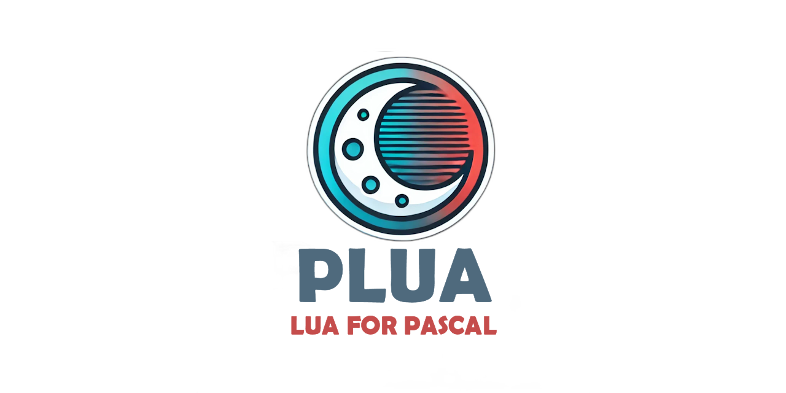

We have integrated the functionality into the jetLua project, available at https://github.com/tinyBigGAMES/jetLua

  
[](https://discord.gg/tPWjMwK)
[](https://bsky.app/profile/tinybiggames.com)

PLUA is a lightweight and powerful 📦 that integrates LuaJIT scripting into <a href="https://www.embarcadero.com/products/delphi" target="_blank">Delphi</a>, enabling you to easily add a scripting layer to your Delphi apps. Whether you're building dynamic software 🖥️, adding mod support 🛠️, or simply looking for a way to make your apps more flexible and customizable, PLUA makes this possible through simple, straightforward APIs.

## 📑 Table of Contents
- [📘 Introduction](#introduction)
- [✨ Key Features](#key-features)
- [🔧 Potential Uses](#potential-uses)
- [🚀 Getting Started](#getting-started)
- [📥 Installation](#installation)
- [📄 Usage Examples](#usage-examples)
- [⚙️ Advanced Features](#advanced-features)
- [📚 API Overview](#api-overview)
- [🤝 Contributing](#contributing)
- [📜 License](#license)

## Introduction
PLUA offers a bridge 🌉 between Delphi and LuaJIT, providing a powerful scripting solution to extend the capabilities of your Delphi projects. With PLUA, Delphi developers can enjoy all the benefits of embedding a dynamic, fast ⚡, and easy-to-use scripting language like Lua, while leveraging LuaJIT for high performance 🏎️.

This library is designed to make integrating Lua into Delphi applications as seamless as possible, focusing on usability, efficiency, and a minimal learning curve 📈. All dependencies are compiled directly into the executable, eliminating the need for external DLLs and making deployment simpler and more reliable ✅.

## Key Features
- **Blazing Fast Performance** ⚡: Built on LuaJIT, PLUA provides exceptional speed, making it suitable for performance-critical applications.
- **Simple APIs** 📜: Easy-to-use API for registering Delphi routines and executing Lua scripts.
- **Seamless Interoperability** 🔄: Effortlessly pass data between Delphi and Lua environments.
- **Interactive Debugging** 🐞: Use `dbg()` in your Lua scripts to start interactive debugging.
- **Custom Routine Registration** ➕: Easily add custom routines in Delphi that Lua scripts can call.
- **Minimal Setup** 🛠️: Requires only a few lines of code to get started.
- **Script Importing and Bundling** 📦: Use a custom `import` command to combine scripts, compile them into a single file, and optionally store them as an EXE resource for a fully self-contained application.
- **No External Dependencies** 🚫📦: All dependencies are compiled directly into the EXE, so there are no external DLLs to maintain.

## Potential Uses
- **Add Modding Support** 🛠️: Enhance your applications by allowing users to create mods.
- **Dynamic Workflows** 🔄: Create flexible workflows with scriptable business logic.
- **Runtime Flexibility** ⏱️: Offload logic to Lua scripts to modify behavior at runtime.
- **Game Development** 🎮: Build games or simulation engines with a powerful scripting layer.

## Getting Started
This section will help you get PLUA up and running in your Delphi environment.

### Prerequisites
- **Delphi 12 CE or higher** 🖥️
- **Windows 10 or higher** 🪟
- **Tested on Windows 11 64-bit (23H2), Delphi 12.2** ✅

### Installation
1. Clone or download the PLUA repository 📂.
2. Add the PLUA source files to your Delphi project.

1. 📥 Download the latest version of [PLUA](https://github.com/tinyBigGAMES/PLUA/archive/refs/heads/main.zip).
2. 📂 Extract the contents to your project directory.
3. ➕ Add the **PLUA** `src` folder to your **Library Path** in Delphi.
4. 📝 In your project, include `PLUA` in the `uses` clause. To leverage the extensions, add `PLUA.Ext` after `PLUA` in the `uses` clause.
5. 📁 Refer to the `examples` folder for detailed usage instructions and demonstrations of the PSFML library in action.

That's it! You should now be able to start scripting with Lua in your Delphi projects 🚀.

## Usage Examples
Here are some simple examples to demonstrate how to integrate PLUA into your Delphi project:

### Loading and Running Lua Scripts 🐍
```pascal
var
  Lua: TLua;
begin
  Lua := TLua.Create();
  Lua.LoadString('print("Hello from Lua!")', False);
  Lua.Run();  
  Lua.Free();
end;
```

### Registering a Delphi Routine to be Used in Lua 🔗
```pascal
procedure MyDelphiRoutine(ALua: ILuaContext);
begin
  // Example routine that pushes a string result onto Lua stack
  ALua.PushValue('Hello from Delphi!');
end;

var
  Lua: TLua;
begin
  Lua := TLua.Create();
  Lua.RegisterRoutine('DelphiRoutine', MyDelphiRoutine);
  Lua.LoadString('DelphiRoutine()', False);
  Lua.Run();
  Lua.Free();
end;
```

### Calling Lua Functions from Delphi 🔁
```pascal
var
  Lua: TLua;
  Result: TLuaValue;
begin
  Lua := TLua.Create();
  Lua.LoadString('function greet() return "Hello from Lua!" end');
  Result := Lua.Call('greet', []);
  ShowMessage(Result.AsString);  
  Lua.Free();
end;
```

## Advanced Features
PLUA also supports advanced features like:

- **Interactive Debugging** 🐞: Add `dbg()` in Lua code to begin debugging, useful for identifying issues during runtime.
- **Script Importing** 📂: Use `import` to bundle various script files into a single compilation unit, which is useful for saving and loading compiled scripts as resources.
- **Bytecode Compilation** 📄: Compile Lua scripts to bytecode using `CompileToStream()`, allowing efficient packaging and distribution.

## API Overview
The PLUA API has been designed to be both powerful and easy to use. Below is a quick reference to key classes and methods:

### TLua 🐍
- **Create/Destroy** ✨: Manage the lifecycle of the Lua instance.
- **LoadStream/LoadString/LoadFile** 📥: Load Lua scripts from various sources.
- **Run** ▶️: Execute the loaded script.
- **Call** 📞: Call a Lua function from Delphi.
- **RegisterRoutine** ➕: Register Delphi routines to be callable from Lua.

### ILuaContext 🌐
- **PushValue/GetValue** 🔄: Push values to or get values from the Lua stack.
- **ClearStack/PopStack** 🗑️: Manage stack states effectively.
- **SetTableFieldValue/GetTableFieldValue** 🧩: Access and manipulate Lua tables.

### Contributing

Contributions to **PLUA** are highly encouraged. Please feel free to submit issues, suggest new features, or create pull requests to expand the capabilities and robustness of the scripting engine.

### License

**PLUA** is distributed under the 🆓 **BSD-3-Clause License**, allowing for redistribution and use in both source and binary forms, with or without modification, under specific conditions. See the [LICENSE](https://github.com/tinyBigGAMES/PLUA?tab=BSD-3-Clause-1-ov-file#BSD-3-Clause-1-ov-file) file for more details.

### Support

- <a href="https://github.com/tinyBigGAMES/PLUA/issues" target="_blank">Issues</a>
- <a href="https://github.com/tinyBigGAMES/PLUA/discussions" target="_blank">Discussions</a>
- <a href="https://learndelphi.org/" target="_blank">Learn Delphi</a>
---
We hope PLUA helps make your Delphi projects more dynamic and flexible. Happy coding! 💻🎉

<p align="center">

</p>
<h5 align="center">

Made with :heart: in Delphi
</h5>

